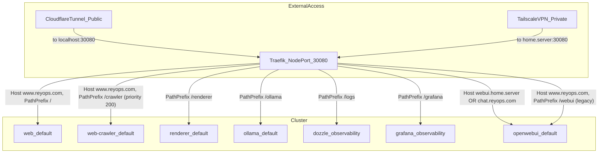
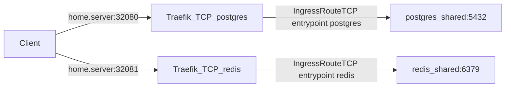

# DevShowcase-Platform

**Technical Portfolio Showcase** by Nelson Fabian Rey

## 🎯 Purpose

This repository demonstrates professional capabilities through a live, self-hosted infrastructure. **DevShowcase-Platform** serves as a technical portfolio showcasing expertise in:

- **Solutions Architecture**: Cloud-native system design and scalability
- **Full Stack Development**: End-to-end application development
- **Kubernetes Orchestration**: Production-grade container orchestration
- **Infrastructure-as-Code**: Automated deployment and configuration
- **AI Agent Development**: Custom intelligent automation systems
- **Observability**: Comprehensive monitoring and logging stacks

## 🚀 What's Running

### Live Infrastructure (24/7)
- **8+ Microservices** deployed on Kubernetes
- **AI agents + services** for web crawling, rendering, and product search
- **GPU-Accelerated LLM** inference with Ollama
- **Comprehensive Monitoring** via Prometheus, Grafana, and Loki
- **Production Security** with zero-trust architecture

### Technical Stack
- **Orchestration**: MicroK8s, Traefik Ingress, Kustomize
- **Backend**: Python (FastAPI, AsyncIO), Node.js
- **Data Layer**: PostgreSQL + pgvector, Redis
- **AI/ML**: Ollama LLM, Vision Models, Custom Agents
- **Observability**: Prometheus, Grafana, Loki, Promtail
- **Security**: Cloudflare Tunnel, TLS/SSL, Secret Management

## 🗺️ Home Server Routing & Endpoints (MicroK8s)

### Entry points (how you reach the cluster)
- **HTTP ingress (Traefik)**: `http://home.server:30080/`
  - Public: Cloudflare Tunnel forwards to `localhost:30080` and sets `Host` headers (e.g. `www.reyops.com`).
  - Private: Tailscale/VPN hits `home.server:30080` directly.
- **Traefik dashboard (NodePort)**: `http://home.server:31080/dashboard`
  - Also reachable via `http://home.server:30080/dashboard` (path-routed), depending on your threat model.
- **PostgreSQL (TCP via Traefik)**: `home.server:32080`
- **Redis (TCP via Traefik)**: `home.server:32081`

### HTTP routing (path/host-based)



### TCP routing (databases)



### Routing priorities (important)
- **`/crawler` beats `/`** on `www.reyops.com` due to higher Traefik priority (crawler 200 vs web 100).
- A **lowest-priority catch-all** keeps local/VPN access working even without host headers (`PathPrefix(/)` priority 1).

## 📍 Live Portfolio

**Web (Nuxt SSR)**: https://reyops.com

This live site showcases the infrastructure and provides links to:
- Professional profile and skills
- Technical demonstrations
- LinkedIn & Upwork profiles
- This repository

## 🏗️ Architecture Highlights

### 1. Web Crawler Service
- Async Python + FastAPI architecture
- PostgreSQL persistence with caching
- Redis-based performance optimization
- Concurrent task processing

### 2. Renderer Service (Playwright-as-a-Service)
- Containerized browser automation
- Screenshot generation API
- HTML rendering endpoint
- Production-ready deployment

### 3. Product Search Agent
- LLM-powered data extraction
- Vision model integration
- Multi-source aggregation
- Intelligent analysis

### 4. Observability Stack
- Prometheus metrics collection
- Loki log aggregation (~91 focused sources)
- Grafana dashboards (4 custom dashboards)
- Alert management

### 5. Shared Infrastructure
- PostgreSQL with Alembic migrations
- Redis with connection pooling
- Repository pattern implementation
- Centralized logging system

## 💼 Professional Context

**Author**: Nelson Fabian Rey  
**Role**: Solutions Architect | Senior Full Stack Developer  
**Location**: Montevideo, Uruguay

This infrastructure represents real-world implementation of:
- Cloud-native architecture patterns
- Microservices design
- DevOps best practices
- Security-first development
- Production operations

## 🔗 Professional Links

- **LinkedIn**: [Nelson Fabian Rey](https://www.linkedin.com/in/nelson-fabian-rey-5177027/)
- **Upwork**: [Freelance Profile](https://www.upwork.com/freelancers/fabianr10)
- **Portfolio**: [reyops.com](https://reyops.com)

## 📚 Repository Structure

```
├── agents/              # AI agents (FastAPI)
│   └── product_search_agent/
├── services/            # Platform services (FastAPI/Node)
│   ├── openwebui_tools/
│   ├── renderer/
│   ├── web/
│   └── web_crawler/
├── shared/              # Shared python package (install root is shared/shared/)
│   └── shared/
├── k8s/                 # Kubernetes manifests
│   ├── argocd/
│   ├── grafana/
│   ├── loki/
│   ├── prometheus/
│   ├── traefik/
│   └── web/
└── docs/                # Documentation
```

## 🛠️ Technology Showcase

### Backend Engineering
- Python (FastAPI, AsyncIO, SQLAlchemy)
- Node.js & TypeScript
- Repository pattern design
- Async/await architecture

### Cloud & Infrastructure
- Kubernetes (MicroK8s)
- Docker containerization
- GitOps (Kustomize)
- Infrastructure-as-code

### Data Engineering
- PostgreSQL + pgvector
- Redis caching strategies
- Database migrations (Alembic)
- Data pipeline architecture

### AI/ML Integration
- LLM agent development
- Vision model integration
- GPU-accelerated inference
- Intelligent automation

### DevOps & Monitoring
- Prometheus metrics
- Grafana visualization
- Loki log aggregation
- CI/CD practices

### Security
- Zero-trust architecture
- Secret management
- OWASP standards
- Production hardening

## 🎯 Key Features Demonstrated

✅ **Scalable Architecture**: Microservices with proper separation of concerns  
✅ **Production-Ready**: 24/7 uptime with comprehensive monitoring  
✅ **Modern Stack**: Latest technologies and best practices  
✅ **Security-First**: Multiple layers of protection  
✅ **Observable**: Full visibility into system behavior  
✅ **Automated**: Infrastructure-as-code and GitOps workflows  

## 📄 License

This repository serves as a portfolio showcase. The code demonstrates technical capabilities and architectural patterns.

---

**Note**: This is a portfolio demonstration project. While the infrastructure runs production-grade components, it's designed to showcase technical skills and architectural knowledge rather than serve as a production service for external use.

For professional inquiries:
- LinkedIn: https://www.linkedin.com/in/nelson-fabian-rey-5177027/
- Upwork: https://www.upwork.com/freelancers/fabianr10
- Website: https://reyops.com

